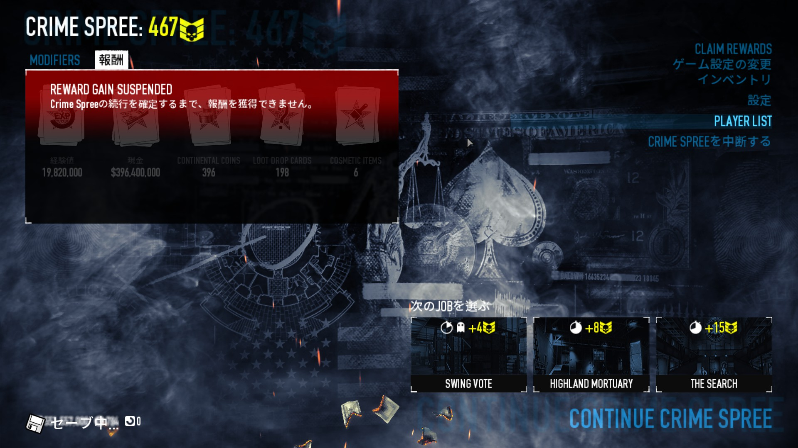

最高 467CS までしかいったことの無い雑魚のメモ。  
楽に INFAMY するためだけに CRIME SPREE 回す人向け。  
ちなみに INFAMY 直後に REP 100 (23,336,413 xp) にジャンプアップするためには 550CS 必要らしい。  

## ビルド

下記の 4 つのビルドをジョブごとに切り替える。

- 戦闘 ビルド
- C4 ビルド (C4 ドリル)
- TRANSPORT ビルド (C4 SAW ドリル)
- ENGINE PROBLEM ビルド (解錠ECM)

全部 Perk は *Anarchist* で *Inspire ACE*、*Joker* 系、*Transporter ACE*、*Parkour BASIC*、*Swan Song ACE* は必須スキル。  
特に重いバッグを運ぶのに Anarchist + Transporter は大分楽になる。  
また、事故防止のために必ずドクターバッグを 1 個以上持ち込む。  

SAW を持ち込む TRANSPORT ビルド以外は *Low Blow* を採用してるが、ドーザーがジャベリン 1 撃で死ぬのが楽しくてやってるだけなので要らないかも。

ENGINE PROBLEM ビルドは地下開通までをステルスで進行するためのもの。無くてもいいかも。  
INTERCEPTION や SANTA'S WORKSHOP などの定点防衛 JOB のためにセントリーガンビルドがあっても良いかもしれない。  

## 当たりジョブ

CS 1 当たり 1分 くらいのレートで、それより短いか同じくらいでクリアできるなら当たり。  
ぼっち Heister なので ECM ラッシュ (SWING VOTE など) や人手不足がダイレクトに響くの (AIR PORT など) は除外。  
BIRTH OF SKY も工夫すればソロでも早いかもしれない。  
とても楽で CS 高かった CLUB HOUSE 返して  

[ENGINE PROBLEM 計算機](https://proudust.github.io/payday2-bigoil/)

| JOB 名                                                      | 位置 |   CS | 装備                   | 備考                                   |
| ----------------------------------------------------------- | ---- | ---: | ---------------------- | -------------------------------------- |
| [INTERCEPTION](#INTERCEPTION)                               | 左   |    3 |                        |                                        |
| [FBI SERVER](#FBI-SERVER)                                   | 左   |    5 | (ECM or C4) and ドリル | ECM ラッシュ or ドアこじ開け           |
| [TRANSPORT](#TRANSPORT)                                     | 中央 |    5 | C4 and SAW and ドリル  |                                        |
| [STEALING XMAS](#STEALING-XMAS)                             | 中央 |    7 | C4                     | 金庫以外は SAW や ECM で代用可能       |
| [WHITE XMAS](#WHITE-XMAS)                                   | 中央 |    7 |                        |                                        |
| [ALASKAN DEAL](#ALASKAN-DEAL)                               | 中央 |    8 | ドリル                 |                                        |
| [BROOKLYN BANK](#BROOKLYN-BANK)                             | 中央 |    8 | ドリル                 |                                        |
| [HIGHLAND MORTUARY](#HIGHLAND-MORTUARY-RESERVOIR-DOGS-DAY2) | 中央 |    8 |                        |                                        |
| [SANTA'S WORKSHOP](#SANTA'S-WORKSHOP)                       | 中央 |    8 |                        |                                        |
| [COUNTERFEIT](#COUNTERFEIT)                                 | 右   |    9 | C4 and ドリル          |                                        |
| [HOTLINE MIAMI](#HOTLINE-MIAMI-HOTLINE-MIAMI-DAY1)          | 右   |   10 | C4                     |                                        |
| [THE BREAKOUT](#THE-BREAKOUT-HOXTON-BREAKOUT-DAY1)          | 右   |   10 | ドリル                 | ドリルはごく稀に必要になる程度         |
| [GREEN BRIDGE](#GREEN-BRIDGE)                               | 右   |   12 | ドリル                 |                                        |
| [COOK OFF](#COOK-OFF)                                       | 右   |   13 |                        |                                        |
| [ENGINE PROBLEM](#ENGINE-PROBLEM-BIG-OIL-DAY2)              | 右   |   14 | ECM                    | ステルスを狙わないなら C4、SAW でも OK |
| [THE SEARCH](#THE-SEARCH-HOXTON-BREAKOUT-DAY2)              | 右   |   15 | C4                     | カードキーが見つからない場合の保険     |

### INTERCEPTION

ダッシュする以外することがない。

### FBI SERVER

ソロステルスは無理でしょ

1. スタート地点の前方向左側の窓を割って侵入
2. 階段周辺のセキュリティドア候補を確認、なければ上がって大きく一周して探す。
3. シャッターにドリルを設置し、トラップマインで遊びながら待機。
4. 開通したらサーバー盗って撤収。

### TRANSPORT

C4 x4 で逃走車両の時短、x8 で稀に即脱出可、x12 で即脱出可。
当然 TRAIN は除外。ソロかつコインが余ってるなら More to Deploy 買って運試しできるけど意外と時短にならない。

### STEALING XMAS

最速でサンタを2回殴ると、稀にバグって次の殴りをスキップできる事がある？(要検証)
時短できない宝石店が出ないことを祈ろう。

### WHITE XMAS

特になし。プレゼントは稀に弾薬袋なども出るので開けて損はない。

### ALASKAN DEAL

砂に注意。最後の脱出時は海側の船に要注意。

### BROOKLYN BANK

脱出地点は地下道があれば地下道から、無ければ駐車場。
駐車場の真ん中辺にいれば轢かれつつもそのまま脱出地点に入る。

### HIGHLAND MORTUARY (RESERVOIR DOGS DAY2)

時短する方法は無いので祈るしか無い。

1. SAW の位置を確認。
2. 道路に出て車の到着を待つ。
3. Mr.Pink を誘導。敵が隣接またはプレイヤーが離れすぎると止まるので注意。
4. SAW の前で待機し、拾えるようになったら回収し、マークされた倉庫へダッシュ。
5. 倉庫に SAW を設置。(1 箇所あたり 45 秒固定)
6. ダイヤモンドを当てたら拾って回収ポイントにシュート。
7. 脱出地点に先回りする。到着前に脱出地点へ向かうための途中の鍵が開けられるようになっているため、それで判別可能。

### SANTA'S WORKSHOP

セントリー使ったほうが良いのでは？と思ったけど使ってない

1. さっさと中に入ってエルフに仕事させる。
2. 4 つ揃ったら近い方の回収地点候補に投げ込む。こっちはあんまり守らなくても盗られることはあんまりない。
3. もう 4 つ揃ったら遠い方の回収地点候補に投げ込む。こっちはよく盗られるので注意。
4. 6 分 50 秒くらいに回収地点が開く。無事に回収されたことを確認したら脱出地点へダッシュ。

### COUNTERFEIT

どうやっても 9 分以上かかるが、途中までステルスで進行できるため楽。

### HOTLINE MIAMI (HOTLINE MIAMI DAY1)

最速なら9分半くらい。ガソスタ爆破後とセーフハウス侵入後に言う行き先を聞き逃さないように。

| 行き先       | バーコード |
| ------------ | ---------- |
| Shaw         | 毛皮製品   |
| Foggy Bottom | ウォッカ   |
| Down town    | タバコ     |
| West End     | 薬品       |
| George town  | ロケット弾 |

### THE BREAKOUT (HOXTON BREAKOUT DAY1)

特になし。
装甲車の上にバッグを置くと落ちながらもなんやかんや最後まで運ばれる事が多いので置くならそこ。

### GREEN BRIDGE

最速で SAW を設置して回る。後は手前に居ることを祈る。
トラップマイン持ち込んだほうが安定するんですかね？

### COOK OFF

脱出地点出現までの時間が結構長いので、調理部屋まで最速で走ったら後は最速で無くとも良い。
ただし一度脱出しそこねるとかなりのロスになるので要注意。

### ENGINE PROBLEM (BIG OIL DAY2)

ステルスでハッキング開始できると、ハッキング中の PC を見られて通報されるまで、ブレーカーを守る必要が無く楽。
外からのサーバー室探しに自信が無い場合は最初からラウドのつもりで C4 か SAW 持っていくと良い。

1. サーバー室を探す。2 階の候補 2 箇所は外からちらっと見れるのでそこから判別。ラップトップかサーバーの緑のランプがあればそこ。両方なければ 1 階。
2. スキを見て ECM 解錠＆ハッキング開始。ステルス続行中なら資料探しは諦めて待機。
3. 残り数秒になったら地下への扉前で待機。
4. 適当なエンジンをバッグに詰めて即座に捨てる。ダッシュで発煙筒を付けに行く。
5. ヘリ待ち中に資料探し＆エンジン運びをする。[計算機](https://proudust.github.io/payday2-bigoil/)を使うと楽。
6. 後はヘリを待って脱出。

ちなみにｇｇると出てくる方の計算機は古く、現在では正解に選ばれない 3, 4, 10 のエンジンが除外されない。

### THE SEARCH (HOXTON BREAKOUT DAY2)

サーバー室まで最速でダッシュし、カードキーを探す。
絶対にブレーカーを落とされてはいけない。
カードキーが見つからなかったとき用に C4 を持っておくと安心。
