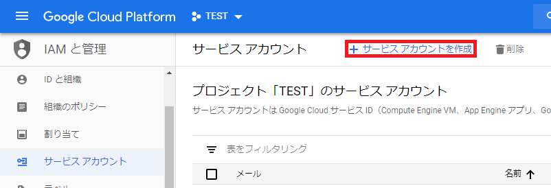
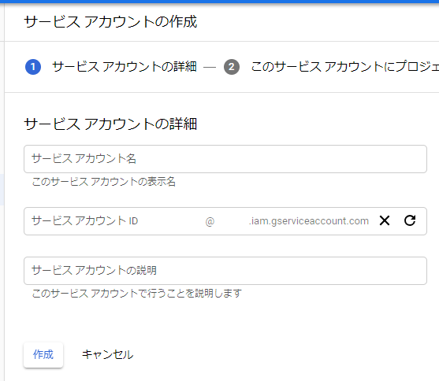
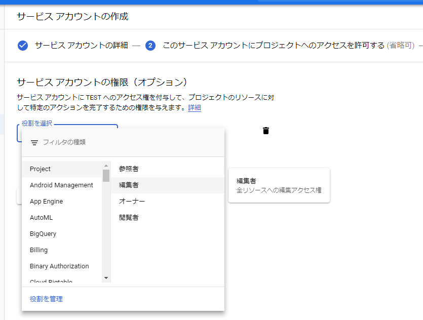

# はじめに
GitLab.comで作成したプロジェクトのDockerイメージをGCPで使用するため、Google Container Registryにpushします。

# 1. [GCP]アービスアカウントの取得
GitLabからGCRにアクセスするためのサービスアカウントを発行します。
GCPのプロジェクト > IAM と管理 > サービス アカウント > サービスアカウントを発行 から発行します。


### 1-1. サービス アカウントの詳細
サービス アカウント名とサービス アカウント ID、サービスアカウントの説明を設定します。
ここは自由に設定してOKです。


### 1-2. このサービス アカウントにプロジェクトへのアクセスを許可する
作成したサービスアカウントに、プロジェクトへのアクセス権を設定します。
ここでは**Project > 編集者**の権限を設定します。
Project > 参照者, Cloud Build > Cloud Build 編集者, ストレージ > ストレージ管理者の3つでもできるらしいですが私の環境ではうまく動いてくれませんでした。


### 1-3. ユーザーにこのサービス アカウントへのアクセスを許可
アクセス権を付与は無視し、GitLabからサービスアカウントへログインするためのキーの作成を行います。
種類にJSONを選び作成を押すと、JSONキーがダウンロードされます。

# 2. [GitLab]環境変数の設定
GitLabのプロジェクト > 設定 > CI/CD > 変数 からCIで利用する環境変数を設定します。
設定する変数は以下の2つです。

| 変数名                | 内容                               |
| :-------------------- | :--------------------------------- |
| GCLOUD_SERVICE_KEY    | 1.で取得したJSONキーの内容をコピペ |
| PROJECT_ID_PRODUCTION | GCPのプロジェクト名                |


# 3. [GitLab].gitlab-ci.ymlの記述


### 3-1. Cloud Buildを使用する場合
``` yaml:.gitlab-ci.yml
image: google/cloud-sdk:alpine

services:
  - docker:dind

before_script:
  - echo $GCLOUD_SERVICE_KEY > ${HOME}/gcloud-service-key.json
  - gcloud auth activate-service-account --key-file ${HOME}/gcloud-service-key.json
  - gcloud config set project $PROJECT_ID_PRODUCTION

build-master:
  stage: build
  script:
    - gcloud builds submit --tag "asia.gcr.io/$PROJECT_ID_PRODUCTION/$CI_PROJECT_NAME" .
  only:
    - master

build:
  stage: build
  script:
    - gcloud builds submit --tag "asia.gcr.io/$PROJECT_ID_PRODUCTION/$CI_PROJECT_NAME:$CI_COMMIT_REF_SLUG" .
  except:
    - master
```
`before_script`でgcloudの認証を行い、`stage: build`でCloud Buildを起動しています。
`gcloud config set project`を忘れると、権限が足りないというエラーが出るので気をつけましょう。(1敗)

### 3-2. docker push コマンドを使用する場合
``` yaml:.gitlab-ci.yml
image: docker:latest

variables:
  DOCKER_DRIVER: overlay
  
services:
  - docker:dind

before_script:
  - apk add --update make ca-certificates openssl python
  - update-ca-certificates
  - wget https://dl.google.com/dl/cloudsdk/release/google-cloud-sdk.tar.gz
  - tar zxvf google-cloud-sdk.tar.gz && ./google-cloud-sdk/install.sh --usage-reporting=false --path-update=true
  - google-cloud-sdk/bin/gcloud --quiet components update
  - google-cloud-sdk/bin/gcloud auth configure-docker
  - docker login -u _json_key -p "$GCLOUD_SERVICE_KEY" https://asia.gcr.io

build-master:
  stage: build
  script:
    - docker build --pull -t "asia.gcr.io/$PROJECT_ID_PRODUCTION/$CI_PROJECT_NAME" .
    - docker push "asia.gcr.io/$PROJECT_ID_PRODUCTION/$CI_PROJECT_NAME"
  only:
    - master

build:
  stage: build
  script:
    - docker build --pull -t "asia.gcr.io/$PROJECT_ID_PRODUCTION/$CI_PROJECT_NAME:$CI_COMMIT_REF_SLUG" .
    - docker push "asia.gcr.io/$PROJECT_ID_PRODUCTION/$CI_PROJECT_NAME:$CI_COMMIT_REF_SLUG"
  except:
    - master
```
`google/cloud-sdk:alpine`イメージで`docker build`を動かすほうが早いと思われますが、うまく動いてくれなかったため仕方なく`docker:latest`で`gcloud`をダウンロードしています。


### 参考

- [Build and Push images to GCP Container Registry with Gitlab CI](https://gist.github.com/foklepoint/2f9087375830068ec032ef326d93f423#gistcomment-2629289)
- [Publishing Google Cloud Container Registry Images from Gitlab CI](
https://medium.com/@gaforres/publishing-google-cloud-container-registry-images-from-gitlab-ci-23c45356ff0e)
