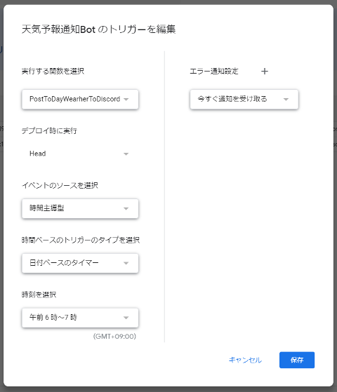
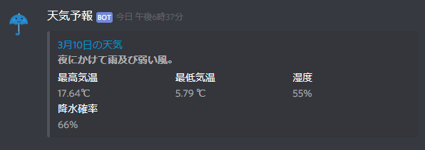

## 概要

友人が「天気予報を Discord に流してくれると便利かも」と言っていたので GoogleAppScript(以下 GAS)を利用して作成してみた。
朝には今日の天気予報を、夕方には明日の天気予報を投稿する。
リポジトリは[proudust/weather-bot-for-discord](https://github.com/proudust/weather-bot-for-discord)。

## 環境設定

GAS なので当然[howdy39/gas-clasp-starter](https://github.com/howdy39/gas-clasp-starter)をベースに作成を始める。

折角なので(？)TSLint を削除して[@typescript-eslint/eslint-plugin](https://github.com/typescript-eslint/typescript-eslint)に切り替えた。
まだ対応が完全ではないのか、@types/google-apps-script で宣言されているグローバル変数 `declare var UrlFetchApp` などを認識してくれないようなので、[selectnull/eslint-plugin-googleappsscript](https://github.com/selectnull/eslint-plugin-googleappsscript)を入れてお茶を濁す。

```bash
npm uninstall tslint tslint-config-prettier tslint-plugin-prettier
npm i --save-dev eslint eslint-config-prettier eslint-plugin-prettier @typescript-eslint/eslint-plugin eslint-plugin-googleappsscript
```

```json:.eslintrc.json
{
  "extends": [
    "eslint:recommended",
    "plugin:@typescript-eslint/recommended",
    "plugin:prettier/recommended"
  ],
  "plugins": [
    "@typescript-eslint",
    "googleappsscript",
    "jest",
    "prettier"
  ],
  "env": {
    "googleappsscript/googleappsscript": true,
    "jest/globals": true
  },
  "parser": "@typescript-eslint/parser",
  "parserOptions": {
    "sourceType": "module",
    "project": "./tsconfig.json"
  },
  "rules": {
    "@typescript-eslint/indent": "off",
    "prettier/prettier": [
      "error",
      {
        "singleQuote": true,
        "semi": true,
        "printWidth": 100
      }
    ]
  }
}
```

## 天気予報の取得

[気象情報API比較してみた](https://qiita.com/Barbara/items/93ae7969691164c7c2bc)を参考に、最高気温と最低気温がちゃんと取れる[Dark Sky API](https://darksky.net/dev)(元 Forecast)を採用した。
さくっとアカウント登録を済ませ、試しに API を叩く。

```bash
curl --request GET \
  --url 'https://api.darksky.net/forecast/$KEY/$LATITUDE,$LONGITUDE?exclude=currently,minutely,hourly,flags&lang=ja&units=si'
```

**パラメータの意味**
- `$KEY`アカウント登録後に表示される Secret Key
- `$LATITUDE,$LONGITUDE`緯度、経度
- `?exclude=currently,minutely,hourly,flags`レスポンスから除外する情報を指定する（これらを除外すると 1 週間分の天気予報だけが残る）
- `&lang=ja`解説などに使用される言語を日本語に設定
- `&units=si`単位を摂氏・メートル法に設定

### 型定義の作成

レスポンスを[json2ts](http://json2ts.com/)に突っ込み、自動生成された型定義を微調整する。
当然リテラル型は認識してくれないので自分で書く。
それぞれの値の意味は[公式](https://darksky.net/dev/docs)や[Dark Sky APIを使ってみました！](https://knowledge.moshimore.jp/entry/dark_sky_api)を参考にした。

``` ts:darksky.ts
type DarkSkyIcon =
  | 'clear-day'
  | 'clear-night'
  | 'rain'
  | 'snow'
  | 'sleet'
  | 'wind'
  | 'fog'
  | 'cloudy'
  | 'partly-cloudy-day'
  | 'partly-cloudy-night';

interface DarkSkyApiResponse {
  latitude: number;
  longitude: number;
  timezone: string;
  daily: {
    summary: string;
    icon: DarkSkyIcon;
    data: {
      time: number;
      summary: string;
      icon: DarkSkyIcon;
      sunriseTime: number;
      sunsetTime: number;
      moonPhase: number;
      precipIntensity: number;
      precipIntensityMax: number;
      precipIntensityMaxTime: number;
      precipProbability: number;
      temperatureHigh: number;
      temperatureHighTime: number;
      temperatureLow: number;
      temperatureLowTime: number;
      apparentTemperatureHigh: number;
      apparentTemperatureHighTime: number;
      apparentTemperatureLow: number;
      apparentTemperatureLowTime: number;
      dewPoint: number;
      humidity: number;
      pressure: number;
      windSpeed: number;
      windGust: number;
      windGustTime: number;
      windBearing: number;
      cloudCover: number;
      uvIndex: number;
      uvIndexTime: number;
      visibility: number;
      ozone: number;
      temperatureMin: number;
      temperatureMinTime: number;
      temperatureMax: number;
      temperatureMaxTime: number;
      apparentTemperatureMin: number;
      apparentTemperatureMinTime: number;
      apparentTemperatureMax: number;
      apparentTemperatureMaxTime: number;
      precipType?: 'rain' | 'snow' | 'sleet';
    }[];
  };
  offset: number;
}
```

GAS で RESTAPI を叩く場合は `UrlFetchApp.fetch()` を用いる。
SECRETKEY はソースコードに含めず、スクリプトのプロパティから読み込む。

``` ts:darksky.ts
const key = PropertiesService.getScriptProperties().getProperty('SECRETKEY');
const apiurl = `https://api.darksky.net/forecast/${key}/${latitude},${longitude}?exclude=currently,minutely,hourly,flags&lang=ja&units=si`;
try {
  const response = UrlFetchApp.fetch(apiurl).getContentText('UTF-8');
  return JSON.parse(response);
} catch (error) {
  Logger.log(JSON.stringify(error));
  throw error;
}
```

## Webhookを叩いてDiscordに投稿

[URLの払い出しは公式を見てもらう](https://support.discordapp.com/hc/ja/articles/228383668-%E3%82%BF%E3%82%A4%E3%83%88%E3%83%AB-Webhooks%E3%81%B8%E3%81%AE%E5%BA%8F%E7%AB%A0)として、データを投稿用に加工する。
Webhook で渡すパラメータは[DiscordにWebhookでいろいろ投稿する](https://qiita.com/Eai/items/1165d08dce9f183eac74)を参考にした。

``` ts
interface DiscordWebhookPayload {
  username?: string;
  avatar_url?: string;
  content?: string;
  embeds?: [
    {
      title?: string;
      description?: string;
      url?: string;
      timestamp?: string;
      color?: number;
      footer?: {
        text?: string;
        icon_url?: string;
      };
      image?: {
        url?: string;
      };
      thumbnail?: {
        url?: string;
      };
      author?: {
        name?: string;
        url?: string;
        icon_url?: string;
      };
      fields?: {
        name?: string;
        value?: string;
        inline?: boolean;
      }[];
    }
  ];
}
```

``` ts
const daily = forecast.daily.data[numberOfDays];
const date = new Date(daily.time * 1000);

const payload: Discord.DiscordWebhookPayload = {
  avatar_url: wearherIconUrl[daily.icon],
  embeds: [
    {
      title: `${date.getMonth() + 1}月${date.getDate()}日の天気`,
      description: `**${daily.summary}**`,
      url: `https://darksky.net/forecast/${forecast.latitude},${forecast.longitude}/si12/ja`,
      fields: [
        {
          name: '最高気温',
          value: `${daily.temperatureMax}℃`,
          inline: true
        },
        {
          name: '最低気温',
          value: `${daily.temperatureMin} ℃`,
          inline: true
        },
        {
          name: '湿度',
          value: `${Math.round(daily.humidity * 100)}% `,
          inline: true
        },
        {
          name: '降水確率',
          value: `${Math.round(daily.precipProbability * 100)}% `,
          inline: true
        }
      ]
    }
  ]
};
```

変換したデータをで Webhook に POST する。Webhook の URL もスクリプトのプロパティから読み込む。
`URLFetchRequestOptions.payload`は `object` も入れられるが、勝手に json に変換してくれるわけではないので変換してから渡す。
また、`content-type`の設定を間違えると意味不明なエラーしか返してくれないので要注意。

``` ts
  const url = PropertiesService.getScriptProperties().getProperty('WEBHOOK');
  const options: GoogleAppsScript.URL_Fetch.URLFetchRequestOptions = {
    method: 'post',
    contentType: 'application/json;multipart/form-data;application/x-www-form-urlencoded',
    payload: JSON.stringify(payload)
  };
  try {
    UrlFetchApp.fetch(url, options);
  } catch (error) {
    Logger.log(JSON.stringify(error));
    return;
  }
```

## GASにソースコードをアップロード

[G Suite Developer Hub](https://script.google.com/home)にアクセスし、新しいスクリプトを作成する。
`UrlFetchApp.fetch`には `https://www.googleapis.com/auth/script.external_request` の権限が必要なので `appsscript.json` に追記しておく。
clasp の扱いは[Google Apps Script をローカル環境で快適に開発するためのテンプレートを作りました](https://qiita.com/howdy39/items/0e799a9bfc1d3bccf6e5)を参考にした。

```json:appsscript.json
{
  "timeZone": "Asia/Tokyo",
  "dependencies": {},
  "oauthScopes": [
    "https://www.googleapis.com/auth/script.external_request"
  ],
  "exceptionLogging": "STACKDRIVER"
}
```

## トリガーの設定

[AppScriptダッシュボード](https://script.google.com/home)から作成したスクリプトの右端にある**︙**ボタンをクリックし、トリガーを選ぶと管理画面が開く。
右下の**トリガーを追加**を選ぶと新しいトリガーの追加ができるので、毎日 6~7 時と 18 時~19 時に設定する。



## 完成品

ちょっと寂しい気もするが、最低限欲しい情報は得られるので良しとした。
またテンプレートに含まれていた Jest を全く使っていないので、次何か作るときは活用するようにしたい。
ソースコードはこちら[proudust/weather-bot-for-discord](https://github.com/proudust/weather-bot-for-discord)


## 参考

- [Google Apps Script をローカル環境で快適に開発するためのテンプレートを作りました](https://qiita.com/howdy39/items/0e799a9bfc1d3bccf6e5)
- [@typescript-eslint ことはじめ](https://teppeis.hatenablog.com/entry/2019/02/typescript-eslint)
- [気象情報API比較してみた](https://qiita.com/Barbara/items/93ae7969691164c7c2bc)
- [DiscordにWebhookでいろいろ投稿する](https://qiita.com/Eai/items/1165d08dce9f183eac74)
