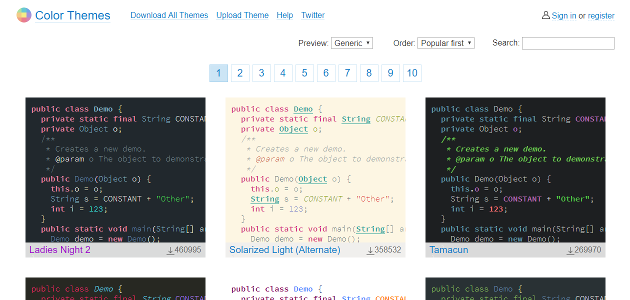

業務でずっと *Visual Studio* 使って C#/HTML/CSS/JS 書いてた人が突然 *Android Studio* を触る羽目になって、いろいろ不便したので書きます。

## *Android Studio* について
*Android Studio* とは Google が無償で提供している、Android アプリケーション開発に特化した IDE です。
全て Google が開発したものではなく、JetBrains が提供している汎用 IDE *IntelliJ IDEA* をベースに、Android 向けの機能を足したものになります。
そのため、Android に依存しない機能について検索するときは `android studio` ではなく `idea` で検索すると出ることがあります。

## 日本語化
*Android Studio* に [Pleiades プラグイン](https://pleiades.io/pages/pleiades_jetbrains_manual.html)をインストールすることで日本語化が可能です。
手順についてはリンク先が詳しいのでここでは触れません。

## シンタックスハイライト
*Visual Studio* に比べるとシンタックスハイライトが違いすぎて困惑すると思います。私はしました。
*Android Studio* はシンタックスハイライトを細かくカスタマイズできるので、自分好みに設定を弄り回しましょう。

### [Color Themes](http://color-themes.com) からシンタックスハイライトの設定をダウンロード
全て自分で設定すると日が暮れてしまうので、公開されている設定をベースにカスタマイズするのがおすすめです。
[Color Themes](http://color-themes.com) では JetBrains 製 IDE で使用できるシンタックスハイライト設定をダウンロードすることができます。
*Android Studio* でも利用できるので、自分好みの設定を探してダウンロードしましょう。

ダウンロードした `.jar` ファイルはメニューバーの `ファイル>設定のインポート` から読み込むことができます。
読み込み後は再起動すると反映されます。

### シンタックスハイライトのカスタマイズ
メニューバーの `ファイル>設定>エディター>カラー・スキームの切り替え` からシンタックスハイライトの設定を変更することができます。
私の場合は以下の設定を行いました。

- `ベース`: [Dark Visual Studio](http://color-themes.com/?view=theme&id=563a1a7680b4acf11273ae91)
- `一般>キャレット行>バックグラウンド`: `#464646`
- `言語デフォルト>インライン・パラメーターのヒント>フォアグラウンド`: `#DCDCDC`
- `言語デフォルト>インライン・パラメーターのヒント>バックグラウンド`: `#464646`

## 選択した行のコメントアウト
*Visual Studio* だと上部のボタンにコメントアウト・コメント解除のボタンがありましたが、*Android Studio* にはありません。
ですがコメントアウトの機能が無いわけではなく、`ctrl + /`でコメントアウト・コメント解除ができます。
`ctrl + shift + /`にすると `/* */` でコメントアウトしてくれます。

## ドキュメントのフォーマット（コードの自動整形）
*Android Studio* でも `ctrl + alt + L` でドキュメントのフォーマットが可能です。
しかし *Visual Studio* と *Android Studio* ではフォーマット形式が異なるため、思った通りに整形してくれません。

### フォーマット形式のカスタマイズ
メニューバーの `ファイル>設定>エディター>コード・スタイル` から各言語ごとにフォーマット形式を変更することが可能です。
以下に Java でのコード整形を *Visual Studio* 風に変更するために必要な項目を挙げます。

- `スペース > 左波括弧の前 > 配列初期化子の左波括弧`: `ON`
- `スペース > 範囲内 > 配列初期化子の波括弧内`: `ON`
- `スペース > 範囲内 > 空配列イニシャライザーの波括弧`: `ON`
- `折り返しおよび括弧 > 波括弧の配置 > クラス宣言内`: `次の行`
- `折り返しおよび括弧 > 波括弧の配置 > メソッド宣言内`: `次の行`
- `折り返しおよび括弧 > 波括弧の配置 > ラムダ宣言内`: `次の行`
- `折り返しおよび括弧 > 波括弧の配置 > その他`: `次の行`
- `折り返しおよび括弧 > 'if()'ステートメント > 新しい行での'else'`: `ON`
- `折り返しおよび括弧 > 'try'ステートメント > 新しい行での'catch'`: `ON`
- `折り返しおよび括弧 > 'try'ステートメント > 新しい行での'finally'`: `ON`

### 保存時に自動整形
更に *Android Studio* のマクロ機能を使い、ファイルの保存時（厳密には `ctrl + S` 押下時）にフォーマットをするように設定できます。
詳しくは [IntelliJ IDEAでファイル保存時にcode formatする](https://qiita.com/sisidovski/items/bde2d844c3c73457923c) の記事を参照して下さい。

## その他
執筆中・・・
