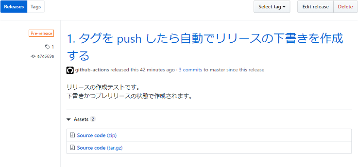
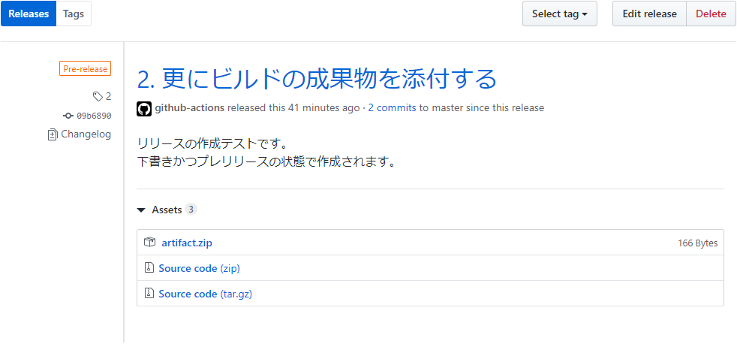
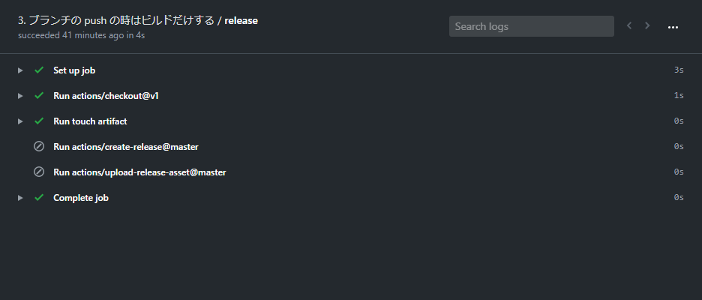
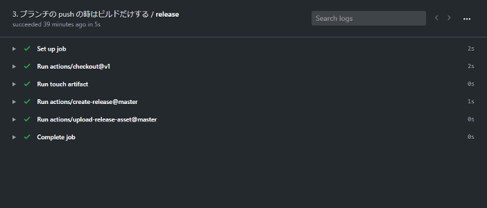
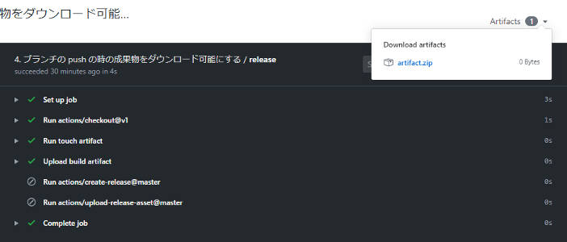
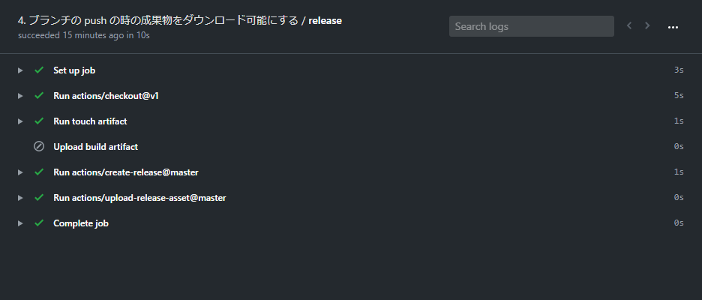

この記事は Qiita の [GitHub Actions Advent Calendar 2019](https://qiita.com/advent-calendar/2019/github-actions) 24 日目の記事でした。

今回はタグをリモートに push したら、リリースを作成とビルドの成果物を添付を自動で行う Workflow の実装例を紹介します。

## 1. タグを push したら自動でリリースの下書きを作成する

リリースの作成には [actions/create-release](https://github.com/actions/create-release) を使用します。
`${{ github.ref }}` は厳密には `refs/tags/(タグ名)` が入りますが、アクション側で `refs/tags/` は取り除かれるので問題ありません。

``` yml
- uses: actions/create-release@v1
  env:
    GITHUB_TOKEN: ${{ secrets.GITHUB_TOKEN }}
  with:
    # リリースのタグ (必須)
    tag_name: ${{ github.ref }}
    # リリースのタイトル (必須)
    release_name: 1. タグを push したら自動でリリースの下書きを作成する
    # リリースのタイトル (省略可能)
    body: |
      リリースの作成テストです。
      下書きかつプレリリースの状態で作成されます。
    # 下書き状態で作成する場合は true (省略時 false)
    draft: true
    # プレリリース表示を付ける場合は true (省略時 false)
    prerelease: true
```

[ソースコード全文](https://github.com/proudust/example-github-actions-release/blob/1/.github/workflows/release.yml)

このワークフローにより、以下のようなリリースが下書きで作成されます。

[](https://github.com/proudust/example-github-actions-release/releases/tag/1)

## 2. 更にビルドの成果物を添付する

ファイルの添付には [actions/upload-release-asset](https://github.com/actions/upload-release-asset) を使用します。
actions/create-release のステップに id を振り、outputs の upload_url を参照できるようにします。
圧縮などはしてくれないので、予め `zip` コマンドなどを使用して圧縮する必要があります。

なお今回の例ではビルドの処理を省略し、`touch artifact` で作成した空の `artifact` ファイルをビルド成果物として記述しています。

``` yml
# ビルド処理に置き換える
- run: |
    touch artifact
    zip artifact.zip artifact

- uses: actions/create-release@v1
  id: create_release # ファイルアップロードに outputs の値を使用するため ID が必要

- uses: actions/upload-release-asset@v1
  env:
    GITHUB_TOKEN: ${{ secrets.GITHUB_TOKEN }}
  with:
    # リリースのアップロード URL (必須)
    upload_url: ${{ steps.create_release.outputs.upload_url }}
    # 添付ファイルのパス (必須)
    asset_path: ./artifact.zip
    # 添付ファイルの表示名 (必須)
    asset_name: artifact.zip
    # 添付ファイルに対応する content-type (必須)
    asset_content_type: application/zip
```

[ソースコード全文](https://github.com/proudust/example-github-actions-release/blob/2/.github/workflows/release.yml)

このワークフローにより、Assets に artifact.zip が追加されたリリースが下書きで作成されます。
[](https://github.com/proudust/example-github-actions-release/releases/tag/2)

## 3. ブランチの push の時はビルドだけする

同じ push イベントでも `github.ref` を確認することでタグが push された場合のみの処理を書くことができます。

``` diff
  on:
    push:
+     branches:
+       - "*"
      tags:
        - "*"
```

``` yml
# ビルド処理に置き換える
- # 略

# タグが push された場合のみ実行される
- uses: actions/create-release@v1
  if: startsWith(github.ref, 'refs/tags/')
  # 略

# タグが push された場合のみ実行される
- uses: actions/upload-release-asset@v1
  if: startsWith(github.ref, 'refs/tags/')
  # 略
```

[ソースコード全文](https://github.com/proudust/example-github-actions-release/blob/3/.github/workflows/release.yml)

このワークフローにより、ブランチの push 時はビルド、
[](https://github.com/proudust/example-github-actions-release/runs/357799156)

タグの push 時は更にリリースの作成が行われます。
[](https://github.com/proudust/example-github-actions-release/runs/357801599)

## 4. ブランチの push の時の成果物をダウンロード可能にする

[actions/upload-artifact](https://github.com/actions/upload-artifact) にファイルパスを渡すことでそのファイルまたはディレクトリを圧縮して ZIP でダウンロードできるようにしてくれます。
ただし以下の点に注意してください。

- path に圧縮済みのファイルを指定しても圧縮処理され、zip in zip という無意味なものが生成される (v2-preview では修正済み)
- 保持期間は push されてから 90 日間、過ぎた場合は削除される
- 手動での削除方法が無い
- 容量制限がある (1GB までらしい)

``` yml
- name: Upload build artifact
  # タグ以外が push された場合のみ実行される
  if: "!startsWith(github.ref, 'refs/tags/')"
  uses: actions/upload-artifact@v1
  with:
    # 表示名 (必須)
    name: artifact.zip
    # アップロードするファイルまたはディレクトリ (必須)
    path: ./artifact
```

[ソースコード全文](https://github.com/proudust/example-github-actions-release/blob/4/.github/workflows/release.yml)

このワークフローにより、ブランチの push 時はアーティファクト、
[](https://github.com/proudust/example-github-actions-release/runs/357829379)

タグの push 時はリリースへビルドの成果物がアップロードされます。
[](https://github.com/proudust/example-github-actions-release/runs/357830908)

## 参考文献

- [GitHub Actions Documentation - GitHub Help](https://help.github.com/en/actions) ([日本語版](https://help.github.com/ja/actions))
- [How to remove uploaded artifact? · Issue #5 · actions/upload-artifact](https://github.com/actions/upload-artifact/issues/5)
