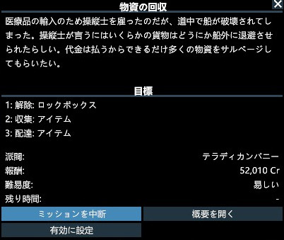
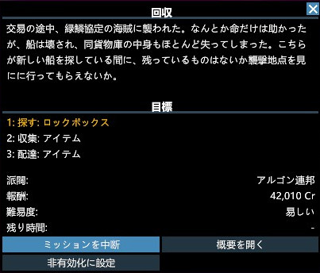
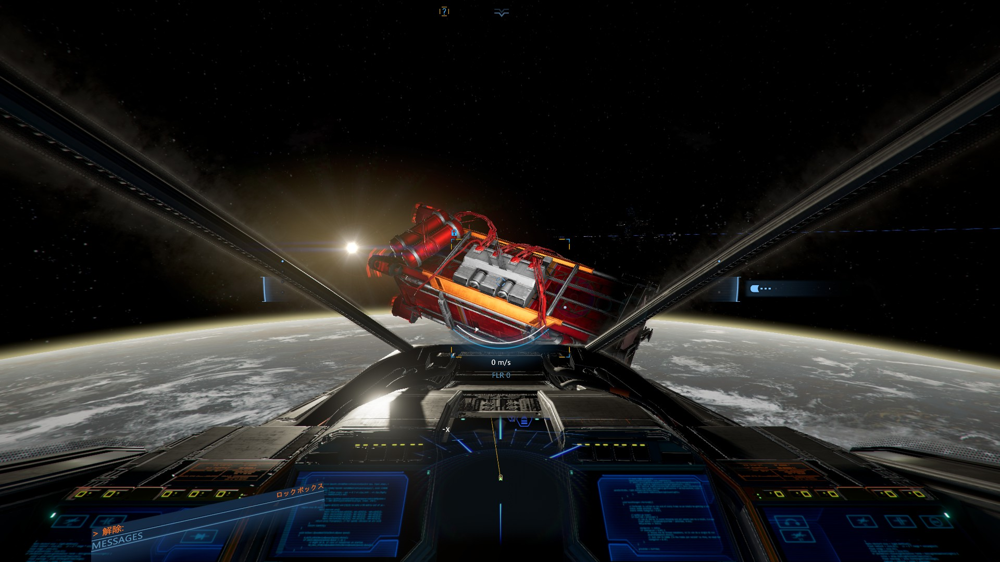

最近 [X4: Foundations](https://store.steampowered.com/app/392160) とかいうめちゃくちゃプレイヤーに不親切なゲームをプレイしているので色々やり方をメモしておく。  
[つー助教授がプレイ動画を投稿している](https://www.nicovideo.jp/series/116190)ので、ありがたく参考にさせてもらおうもらってますありがとう。  

このゲームはとにかくお金が無いと何もできないので、何らかの方法で金策しなくてはならない。  
今回は数あるミッションの内、以下のようなロックボックス回収ミッションのやり方をメモする。  

## 必要なもの

- **ハンドレーザー**  
  各ステーションにある交易商のたまり場から購入できる。大体 63,000Cr 前後？チュートリアルでは最初から持ってるので忘れがち。

## 手順

1. 指定の範囲でロックボックスを探す
2. ロックボックスの鍵を破壊し、中身を回収する
3. 指定の場所に中身のアイテムを配達する

### 指定の範囲でロックボックスを探す

かなり広い範囲のどこかにある小さな箱を探せとかいう、落としたコンタクトレンズを探すかのような途方も無い作業をしなければならない。  
当然普通に探すのは無理があるので**広範囲スキャン**という宇宙船の便利機能を使おう。使い方は簡単。  

1. `Shift + 3` を押して広範囲スキャンモードに切り替え
2. `R` を長押しして適当に離す

これで自船を中心とした半径 25km くらいの物体を探して表示してくれる。  
これを範囲内を移動しながら連発しまくって探す。  

### ロックボックスの鍵を破壊し、中身を回収する

こんな感じの箱がロックボックス。このスクショで言うと左側に赤丸が 4 箇所表示されているので、すべてを船の小型パルスかハンドレーザーで狙い撃つとロックが外れる。

小型パルスで良いならハンドレーザー要らなくね？と思うかもしれないが、スクショのような**爆弾付きのロックボックスを小型パルスで撃つと爆発して失敗**になる。  
失敗になるだけならまだしも、**小型艦では致命傷になりそのままゲームオーバー**になったりする。怖いですね。(6 敗)  

### 指定の場所に中身のアイテムを配達する

指定個数のロックボックスを回収すると、指定の場所へ中身のアイテムを配達するよう指示が出る。  
このタイミングでキャンセルすれば中身は自分のものになるのだろうが、メリットは特に無いと思う。  
