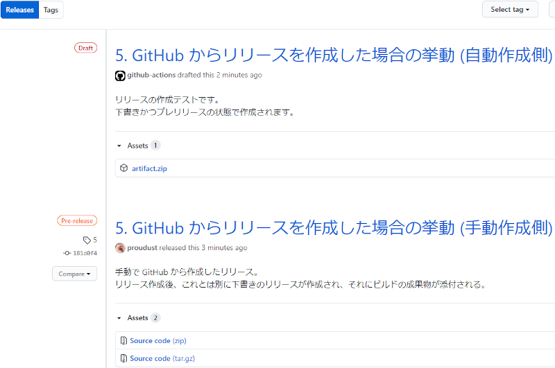

以前書いた[タグを push したら GitHub Actions でリリースの下書きを作成+α](https://proudust.github.io/20191220-create-release-with-ghactions/)の続きになります。

## 5. GitHub からリリースを作成した場合の挙動

前回の方法では Git からタグを push する前提で作成しましたが、それ故に GitHub からリリースを手動で作成した場合に面倒なことになってしまいます。



このように手動作成したリリースとは別に下書きのリリースが作成され、それに成果物が添付されるという挙動をしてしまいます。  
今回はこれを何とかしようと思います。  

## 6. 手動作成したリリースにビルドの成果物を添付する

一旦これまでの色々を殴り捨てて、手動作成したリリースにビルドの成果物を添付するワークフローにしてみます。
`github.event` には event ごとに対応したデータが入っており、その内容は [Webhook event payloads](https://developer.github.com/webhooks/event-payloads/) に詳細が載っています。

``` yml
on:
  release:
    types: [published]

jobs:
  release:
    steps:
      # 省略
      - uses: actions/upload-release-asset@v1
        env:
          GITHUB_TOKEN: ${{ secrets.GITHUB_TOKEN }}
        with:
          upload_url: ${{ github.event.release.upload_url }}
          asset_path: ./artifact.zip
          asset_name: artifact.zip
          asset_content_type: application/zip
```

[ソースコード全文](https://github.com/proudust/example-github-actions-release/blob/6/.github/workflows/release.yml)

このワークフローにより、手動作成したリリースにビルドの成果物が自動で添付されます。

## ex. タグにリリースがあれば取得、なければリリースを作成するアクション

自分で使おうと思って書いたけれども、結局使わなかったスクリプト。
一応動作確認はしましたが、自分で修正できる人向けです。

``` yml
      - name: Get or create Release
        id: create_release
        uses: actions/github-script@v2
        env:
          tag_name: ${{ github.ref }}
          draft: true
        with:
          script: |
            const { owner, repo } = context.repo;
            const tag = context.ref.replace('refs/tags/', '');
            let release;
            try {
              release = await github.repos.getReleaseByTag({ owner, repo, tag });
              core.debug('Found published release with the specified tag.');
            } catch {
              const draft = process.env.draft.toLowerCase() === "true";
              release = await github.repos.createRelease({ owner, repo, tag_name: tag, draft });
              core.debug('Created new release.');
            }
            const { id, html_url, upload_url } = release.data;
            core.setOutput('id', id);
            core.setOutput('html_url', html_url);
            core.setOutput('upload_url', upload_url);
            core.setOutput('tag', tag);
```
